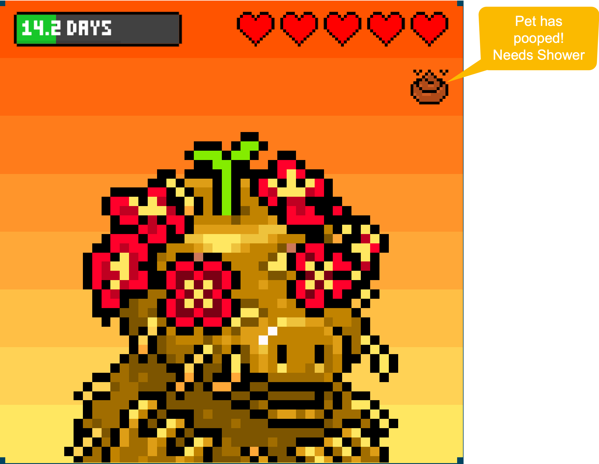
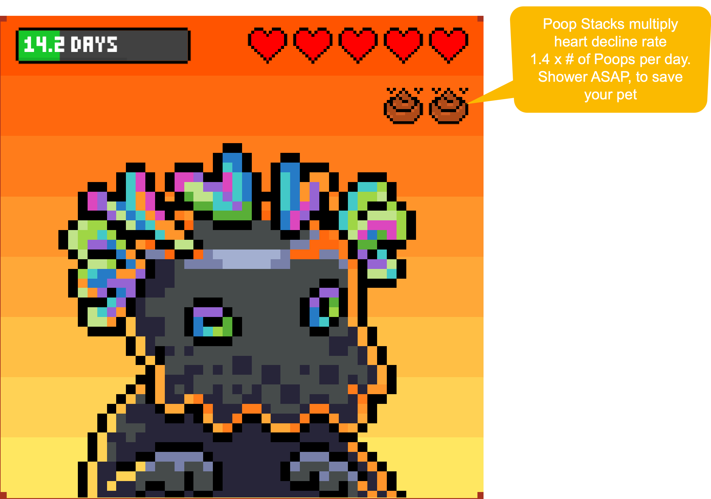
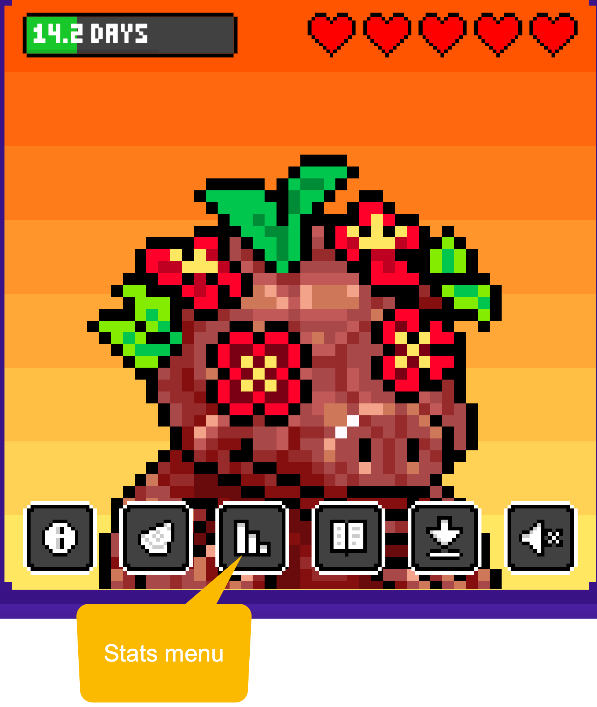
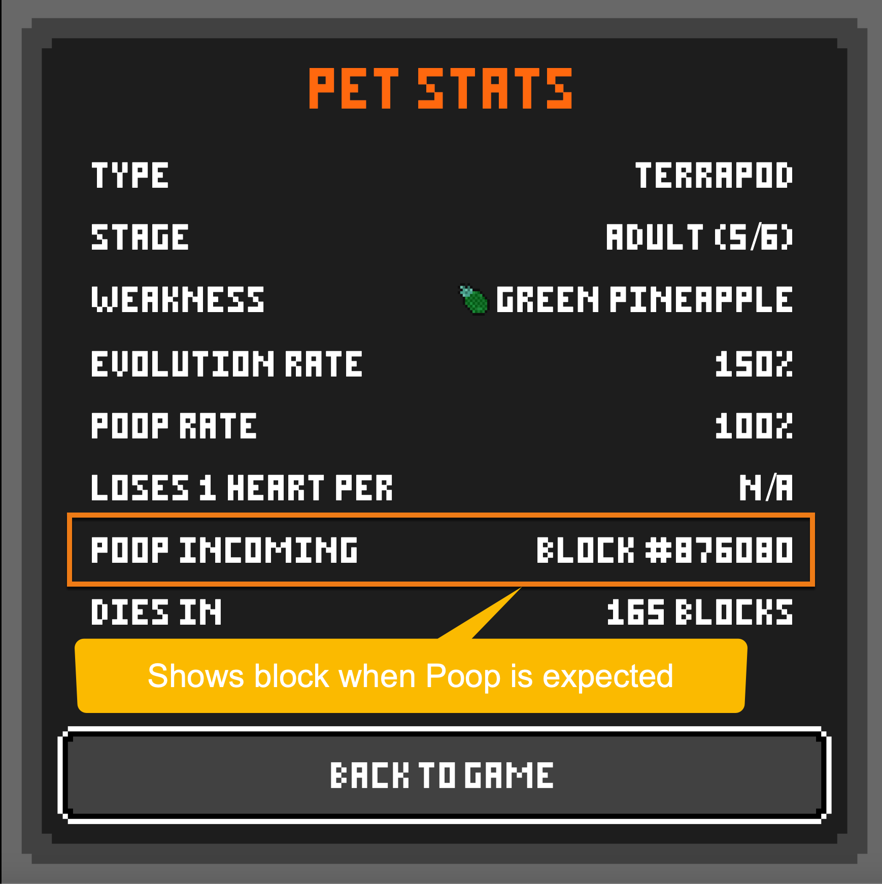

# ☠️ Poop Management

## Understanding Heart Loss and Poop 💔💩

Managing poop is critical to keeping your Pizza Pet alive and healthy. As we’ve mentioned, pets lose **1 heart ❤️ per day** under normal circumstances. But let’s break down the math:


The actual calculation is **1 heart per 144 blocks**. Assuming an average block is mined every 10 minutes, 144 blocks equates to roughly **1 day**. This is how the game calculates 1 heart lost per day.


When a pet poops, their **heart loss rate increases** significantly. Let’s explore the mechanics of poop and how to handle it effectively.

***

## Poop Probability by Feed Type 🍕🍺

Different types of feeds affect the probability of poop. Here’s how it breaks down:

| Feed Type | Hearts Gained | Poop Probability |
| --------- | ------------- | ---------------- |
| 🍕 Pizza  | +1 ❤️         | 23%              |
| 🍺 Beer   | +2 ❤️❤️       | 69%              |

Choosing the right feed is a balancing act—while Beer provides more hearts, it comes with a much higher poop risk.

***

## The Consequences of Poop 🤢

Poop isn’t just gross—it’s dangerous. Here’s why:

* When a pet poops, its **heart loss rate increases to 1.4 hearts ❤️💕 per day**.
* Poops can **stack**, meaning each additional poop multiplies the heart loss rate. For example:
  * **1 poop = 1.4 hearts ❤️💕/day**
  * **2 poops = 2.8 hearts ❤️❤️💕/day**
  * **3 poops = 4.2 hearts ❤️❤️❤️❤️💕/day**


Multiple poops can only occur with **multiple feeds**. For example, if you’ve fed your pet several pizzas, beers, or a combination of both, and the pet hasn’t pooped yet, it can poop once for each of those feeds. Without feeding, pets will not poop.


Letting poop stack is like leaving your Bitcoin private keys unguarded—it’s a disaster waiting to happen. **Satoshi would never do that, why would you?**

***

## Removing Poop with Showers 🚿

To remove the impact of poop:

* **Use a shower.** One shower cleans all poop, returning the heart health decline rate to the normal **1 ❤️ per day**.
* Showering is a critical game action, especially if no **PEDs (Performance Enhancing Drugs)** or **SADs (State Altering Drugs)** are applied.

***

## Poop Frequency and Timing 🕒

### Baby Stage 🍼

* **Poops immediately after feeding** (if the feed triggers poop).
* If no poop appears immediately after a confirmed feeding transaction, the baby pet won’t poop until the next feed.

### Child, Teen, and Adult Stages 🧒🧑🦸‍♂️

* Pets in these stages can poop **randomly within 7 days** after a feed.
* These pets can poop multiple times during this period, requiring close attention.


For pets to poop multiple times, they must have been fed multiple times without pooping. Each feed gives the pet one chance to poop, which it may use over time. Without a feed, pets will not poop.


To anticipate poop, check the **stats menu** on your pet. This menu shows the block in which poop is expected, helping you plan your next move.

***

## Viewing Poop Icons and Examples 👀

Let’s take a look at the icons used in the game to represent hearts and poop, including stacked poop icons.




<figure><figcaption>
Heart and Poop Icons
</figcaption></figure>





<figure><figcaption>
Stacked Poop Icons
</figcaption></figure>




***

## Checking Poop Status 🛠️

To know when your pet is expected to poop:

1. Click the **stats menu** on your pet.
2. View the block where poop is incoming.




<figure><figcaption>
Stats Menu Showing Poop Incoming
</figcaption></figure>

<figure><figcaption>
Stats Menu Showing Poop Incoming
</figcaption></figure>








This feature allows you to clean poop promptly after it appears, preventing additional heart loss.

***

## Advanced Strategies for Poop Management 🧠

While showers are the standard solution, advanced players can use **PEDs (Performance Enhancing Drugs)** and **SADs (State Altering Drugs)** to mitigate poop impact:

* **LSD:** Pauses the game, halting heart decline temporarily. Pets won’t poop or experience heart decline during this time.
* **Cocaine:** Similar effects to LSD but with a catch—if the drug’s effect isn’t removed before its duration expires, the pet will die.

These mechanics are covered in detail in the **Advanced Strategies** section.

***

## Final Thoughts 🐾

Poop management is vital to your pet’s survival. By understanding when and how poop impacts heart health, using showers effectively, and anticipating poop events with the stats menu, you can keep your Pizza Pet thriving. Stay vigilant, clean that poop, and remember: **Satoshi wouldn’t let poop stack, so neither should you!**

👇 Up next: **Evolution Stages**—discover how your Pizza Pet grows, evolves, and transforms through the stages of its life cycle. Understanding evolution is key to keeping your pet alive and unlocking its full potential!
