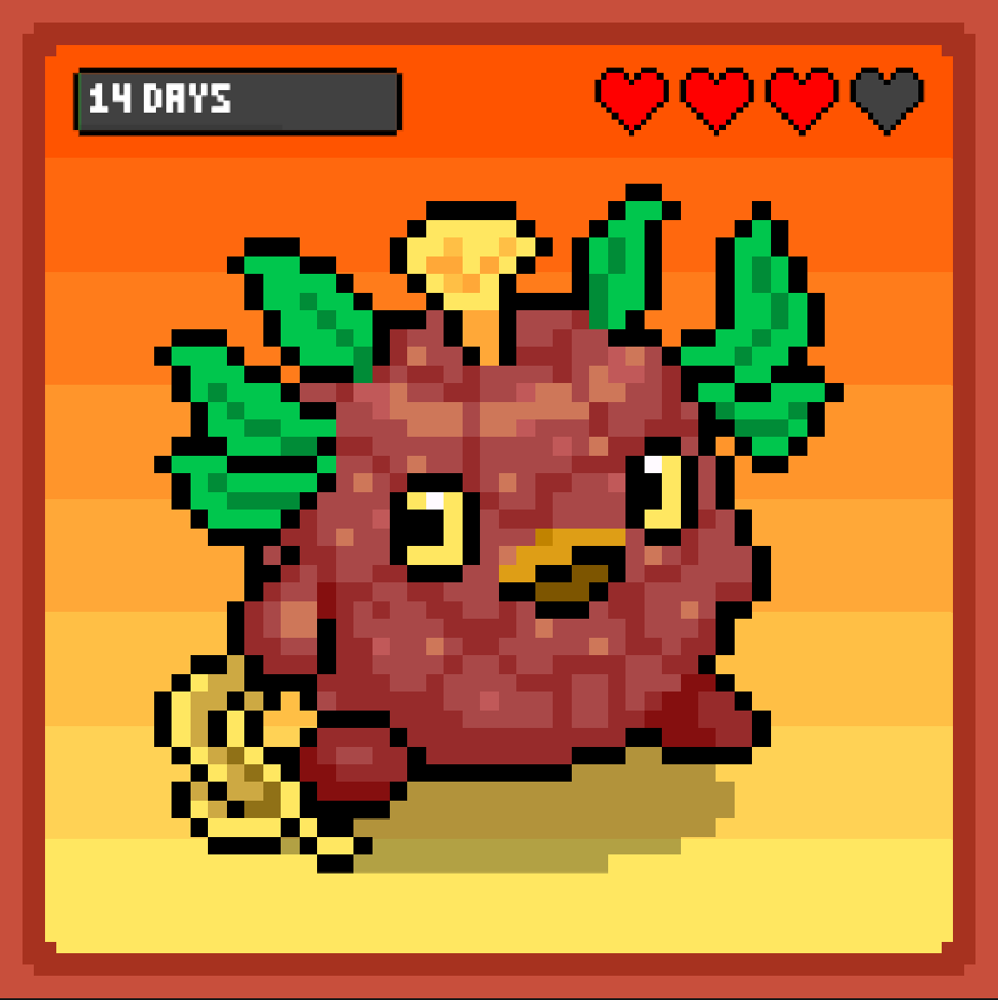
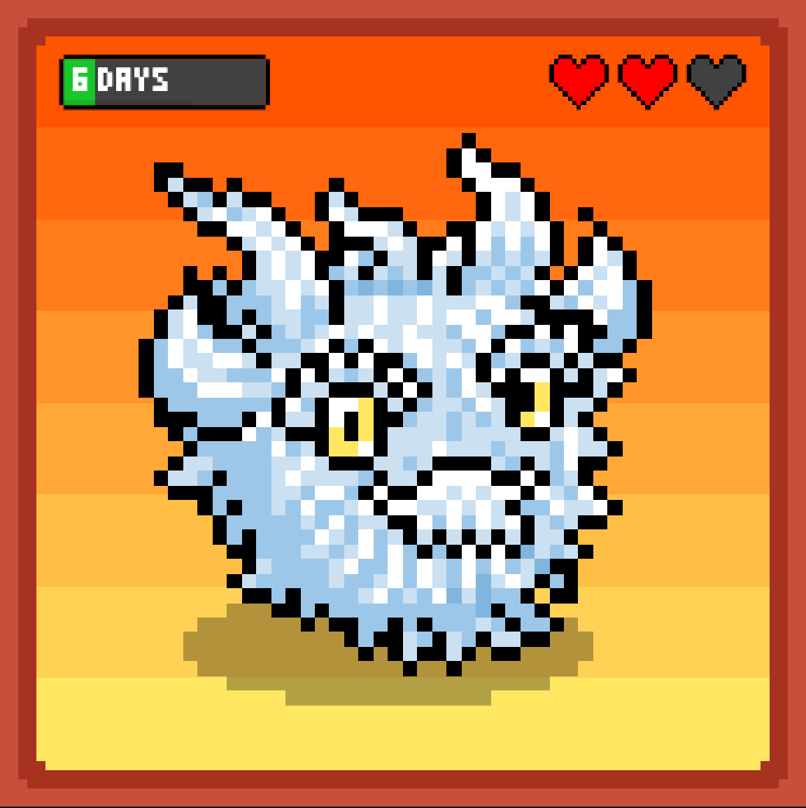
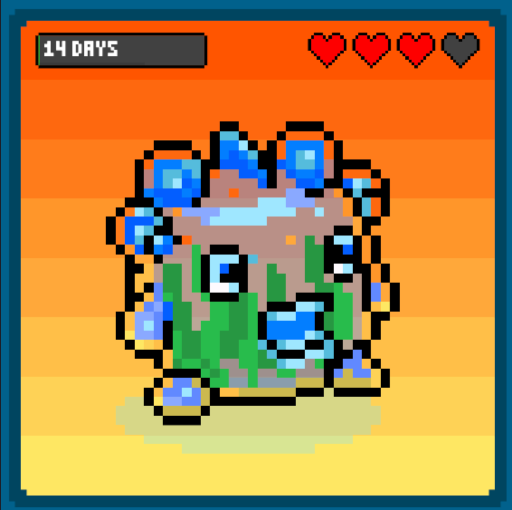
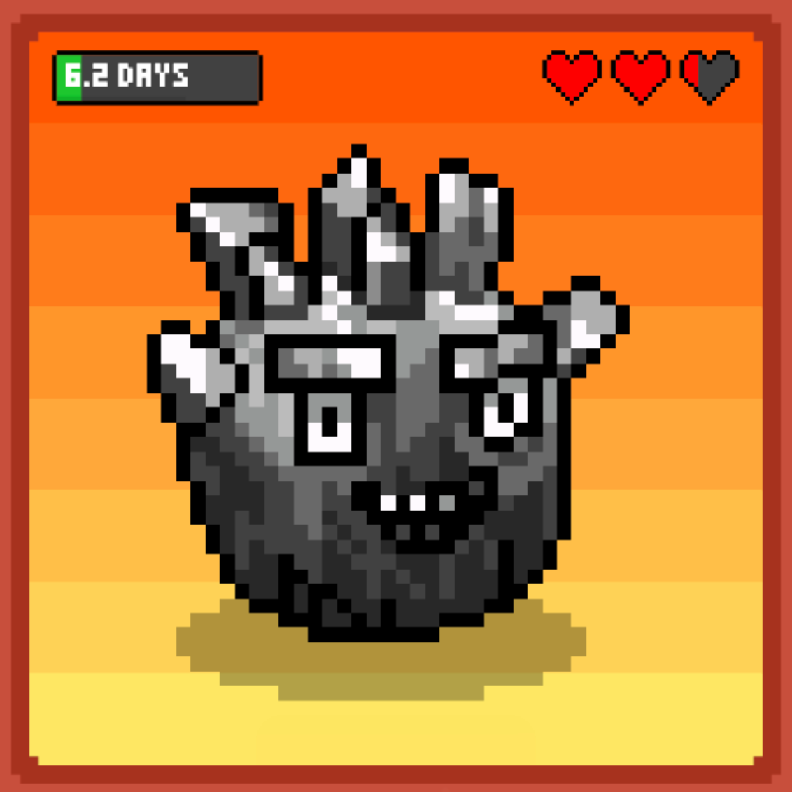
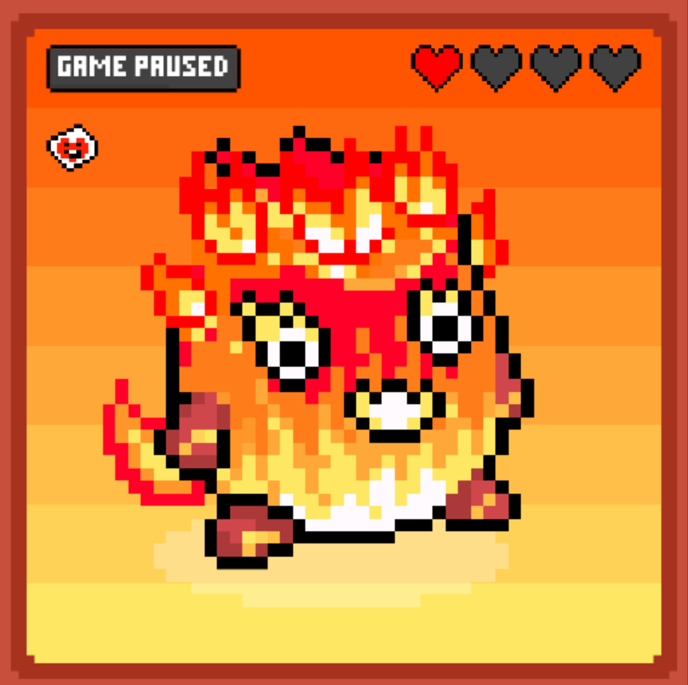
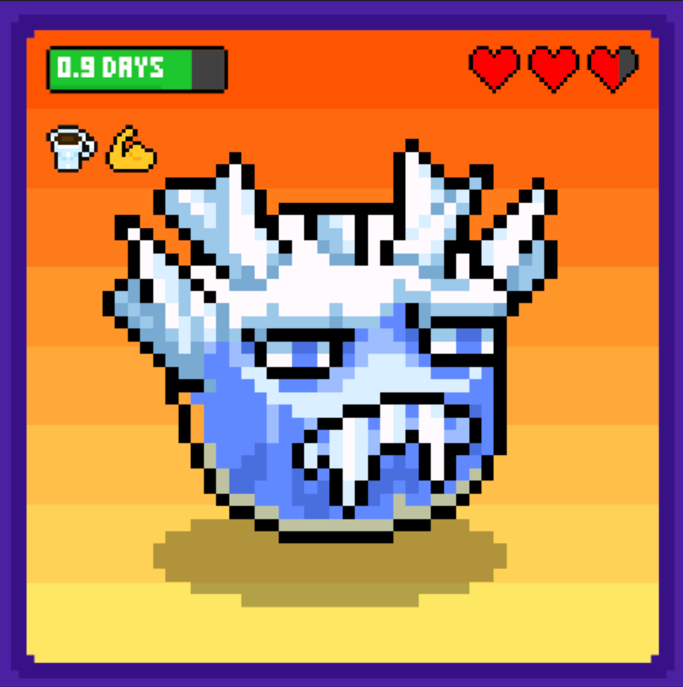
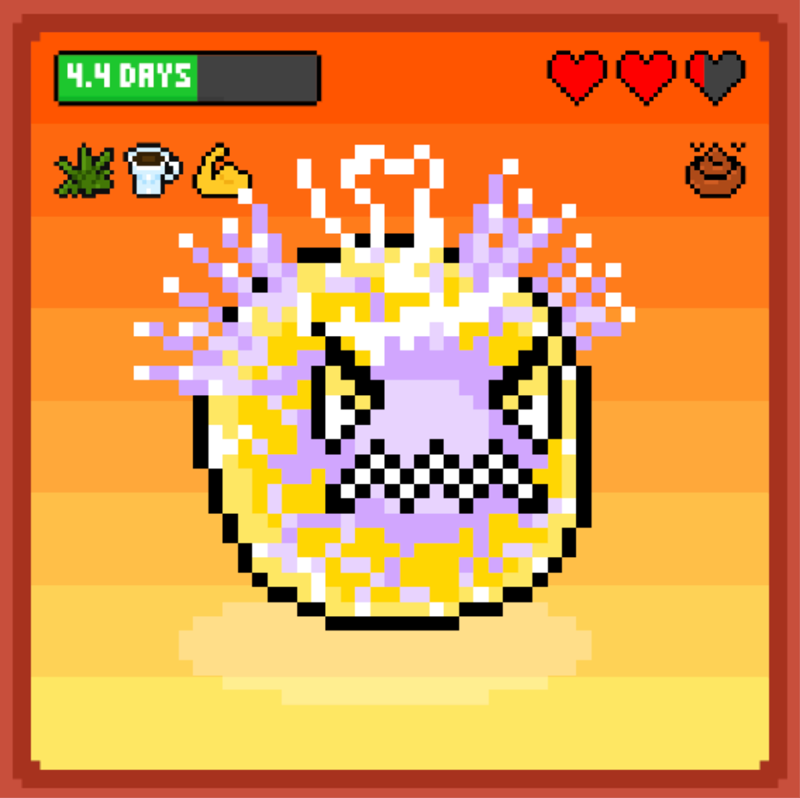
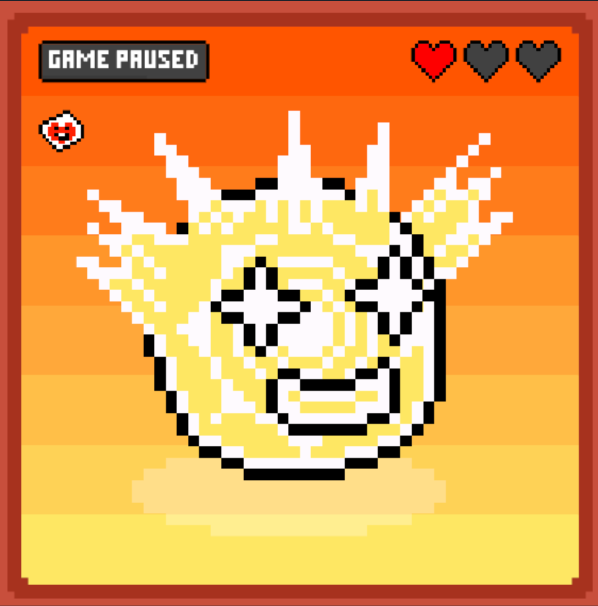
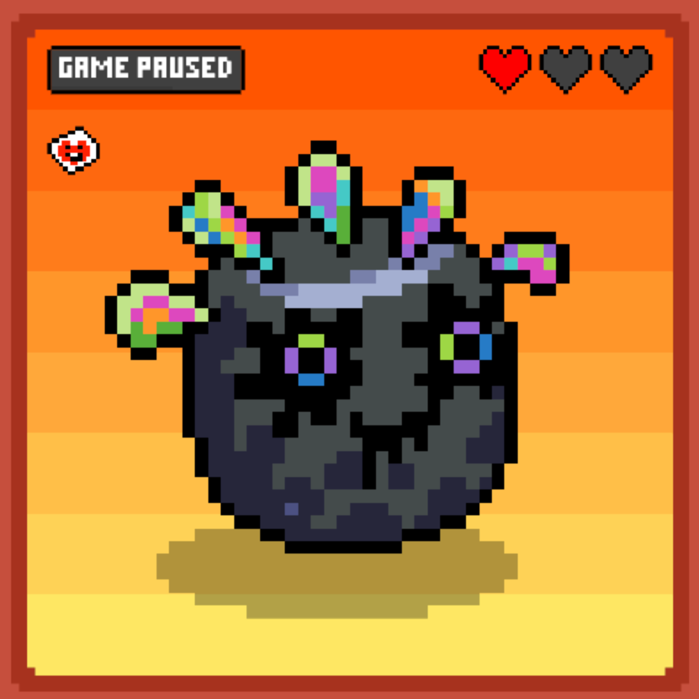
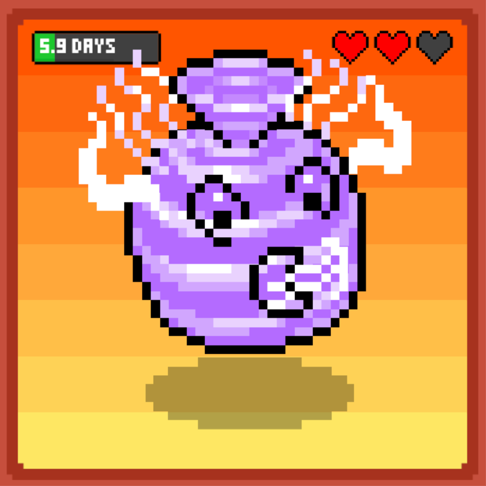

# 🐾 Types of Pizza Pets

## Meet the Pizza Pets 🍕🐾

Pizza Pets are as unique as a perfectly crafted pizza—each one with its own flair and personality. In the world of Pizza Pets, there are **11 distinct types** of pets you can collect and care for. Each type offers its own special traits and charm, making them highly sought after by collectors and players alike. Let’s take a closer look at each type!

***



***

### Mythtail 🐉

**Description:**

The legendary **Mythtail** is a creature of myths and legends, shrouded in mystery and awe. Its elegant design makes it a collector's favorite.




<figure><figcaption>
Mythtail - Yellow
</figcaption></figure>




<figure><figcaption>
Mythtail - Pink
</figcaption></figure>







***

### Terrapod 🐢

**Description:**

Meet **Terrapod**, the grounded protector with a shell tough enough to withstand the harshest conditions. It’s the tank of the Pizza Pets family.




<figure><figcaption>
Terrapod
</figcaption></figure>








***

### Fluffypuff 🐑

**Description:**

Cuteness overload! **Fluffypuff** is as soft and huggable as it sounds. Don’t let its fluff fool you—it’s a survivor!




<figure><figcaption>
Fluffypuff
</figcaption></figure>








***

### Aquafin 🐠

**Description:**

Diving into the deep, **Aquafin** is the master of all things aquatic. Its sleek design makes it a showstopper in any collection.




<figure><figcaption>
Aquafin
</figcaption></figure>








***

### Coalvim 🪨

**Description:**

Born from the depths of the earth, **Coalvim** is as solid as a rock. This pet symbolizes strength and resilience.




<figure><figcaption>
Coalvim
</figcaption></figure>








***

### Flamora 🔥

**Description:**

Hot-headed and full of flair, **Flamora** lights up the competition with its fiery spirit and blazing charm.




<figure><figcaption>
Flamora
</figcaption></figure>








***

### Frostfang ❄️

**Description:**

Cold and calculating, **Frostfang** is the icy beast you want on your side. Its frosty demeanor is matched only by its sharp instincts.




<figure><figcaption>
Frostfang
</figcaption></figure>








***

### Electroid ⚡

**Description:**

Charged with energy, **Electroid** is the spark of any collection. Its electrifying personality keeps things lively and exciting.




<figure><figcaption>
Electroid
</figcaption></figure>








***

### Sunbloom 🌻

**Description:**

Radiating warmth and positivity, **Sunbloom** is the cheerful companion everyone needs. It’s sunshine in pet form!




<figure><figcaption>
Sunbloom
</figcaption></figure>








***

### Petroil 🛢️

**Description:**

With a sleek, industrial vibe, **Petroil** is the embodiment of raw power and efficiency. This one’s a true machine of survival.




<figure><figcaption>
Petroil
</figcaption></figure>








***

### Galewing 🌪️

**Description:**

Swift and graceful, **Galewing** is the aerial ace of Pizza Pets. Its mastery of the skies is unmatched.




<figure><figcaption>
Galewing
</figcaption></figure>








***

### What's Next? 🌟

Now that you’ve met the Pizza Pets, let’s explore how to keep them happy and healthy. 🍕
